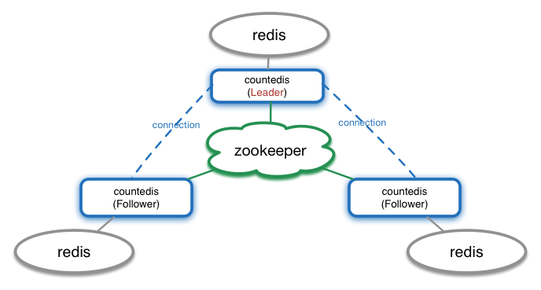

# Introduction

This is a simple project focus on `count` operation such as addition and subtraction. It's also a distributed project based on [zookeeper](https://zookeeper.apache.org) and [redis](http://redis.io). As you can guess, it is an intermediate cache layer, between the application layer and persistent layer, and it provides failover by replication.

There is a inescapable topic when we talk replication, in particular, data replication: data consistency. Usually，there are three consistency principles: strong consistency, weak consistency and eventual consistency. Right now, in this revision, `countedis` assume the data is sensitive and adopt strong consistency. Also because of the implementation of strong consistency is relatively easier. In the future, maybe I'll change consensus algorithmn (such as [raft](https://raft.github.io)) to support the eventual consistency or adjustable consistency.

Inspired by [kafka](http://kafka.apache.org), `countedis` strongly depends on [zookeeper](http://kafka.apache.org/documentation.html#zk) to maintain the cluster relationship. Supported zookeeper version is 3.4.6. `countedis` use [curator](http://curator.apache.org/index.html) as client layer to interact with zooKeeper.

The redis version should be 2.8+, every redis instance don't know each other. The data synchronization of redis is completed by `countedis`.


# Install

For now, this project not published to Maven Central, so you have to build it manully. Because `countedis` is written by [Scala](http://www.scala-lang.org) and use [sbt](http://www.scala-sbt.org) as its build tool, you could use sbt `package` command to build it:

```sbt
cd $your_coutedis_directory/
sbt clean package
```
or use sbt `publishLocal` command to publish it to your local Ivy repository:

```sbt
cd $your_coutedis_directory/
sbt clean publishLocal
```

or open `$your_coutedis_directory/build.sbt` file, add `publishTo in ThisBuild := Some(Resolver.file("file",  new File( "path/to/your/local/maven-repo" )) )
` to the first line, then use sbt `publish` command to publish it to your local Maven repository:

```sbt
cd $your_coutedis_directory/
sbt clean publish
```

*Note*: only support Scala 2.11.x right now.

# Goal and Design

Main goal of `countedis` is to relieves pressure on the persistence layer by `redis`, at the same time, provides atomic operation and asynchronous data synchronization to persistence layer.

In `countedis`, there are 4 main roles:

* zookeeper: stores meta data of `countedis` for service discovery and leader election.
* redis: stores the business data is used to `count`
* loader: you have to provide one loader instance for the situation of the data not exists in redis or expired in redis.
* consumer: if you care about the operation log, you should provides one consumer instance.

For example, assume we have 1 zookeeper cluster, 3 redis instance. We can have the following application structure:



As you can see, `countedis` plays the role of `redis`'s agent, every `countedis` instance have to connected to zookeeper. At the same time there can be only one `countedis` instance as the leader，and the leader connects to all of the follower `countedis` instance.

## project

This project consist of 2 sub-project: `coutedis-core` and `coutedis-net`. As the name shown, `countedis-net` is responsible for the underlying data communications, it's based one [netty 4](http://netty.io), and can be used alone. `countedis-core` build on `countedis-net`, it implements leader election and data copy, you should depends on it for the `count` purpose.

## throughput

The throughput will be impact seriously if the follower respond sllowly when your call write operation,  because of the data strong consistency strategy. The write operation will effect leader first，then effect followers concurrently if the leader effect success. So the throughput depending on the sllowerest follower. If your application need higher throughput, you could try to minimize the number of followers.

## scale out

If you have heavy read operation and small write operation, you can scale out countedis cluster by add `countedis` instance and `redis` instance. You should flush the new redis instance to prevent data inconsistency when decide to add new `redis` instance.

# Usage

Add `countedis-core` to your dependencies. You can use Java or Scala code to invoke the api of `countedis-core`.

Initialize, in Java:

```java
Countedis countedis = CountedisFactory
                .builder(7891)
                .zkAddress("127.0.0.1:2181")
                .zkNamespace("myCountedis")
                .zkSessionTimeoutMs(5000)
                .redisAddress("127.0.0.1:6379")
                .expireSecond(6000)
                .cacheLoader(new CacheLoader() {
                    public long load(String key) {
                        return 0;
                    }
                }).logConsumer(new LogConsumer() {
                    public void consume(CountLog log) {
                        // do something with log
                    }
                }, 10)
                .build();
```

in Scala:

```scala
val c1 = CountedisFactory
      .builder(7891)
      .zkAddress("127.0.0.1:2181")
      .zkNamespace("myCountedis")
      .zkSessionTimeoutMs(5000)
      .redisAddress("127.0.0.1:6379")
      .expireSecond(6000)
      .cacheLoader(new CacheLoader {
        override def load(key: String): Long = ???
      }) 
      .logConsumer(new LogConsumer {
        override def consume(log: CountLog): Unit = ???
      }, 10)
      .build()
```

In above example, we make a countedis instance by `CountedisFactory`. The api style is fluent:

* the `build(...)` method indicates the port that countedis used;
* and `zkAddress(...)` method needs address of zookeeper as the argument;
* the `zkNamespace(...)` method pass the namespace(the default is 'countedis');
* the `zkSessionTimeoutMs(...)` method means the zk session timeout millis(the defualt is 3000);
* the `redisAddress(...)` method indicates the redis address;
* the `expireSecond(...)` method means the expired seconds of data in redis(the default is 0 means no expired)
* the `cacheLoader(...)` method needs `CacheLoader` instance as the argument for load data to redis, and you have to offer it;
* the `logConsumer(...)` method needs `LogConsumer` instance as the argument for consume write operation log if you don't disable log, for example, you could write the log data to RDB;
* the `disableLog()` method means disable log and you don't have to provid `LogConsumer` instance when you don't care write operation log.

`count` api. For example, we have two k/v pairs: key1=10 and key2=20.  
In Java:

```java
CountedisResult r1 = countedis.decr("key1");
Long v1 = (Long) r1.kv().get("key1"); //key1 is 9

CountedisResult r2 = countedis.incrBy("key1", 10);
Long v2 = (Long) r2.kv().get("key1"); //key1 is 19

CountedisResult r3 = countedis.transfer("key1", "key2", 9, "your json string");
Long v3 = (Long) r3.kv().get("key1"); //key1 is 10
Long v4 = (Long) r3.kv().get("key2"); //key2 is 29
```

In Scala:

```scala
val r1 = c1.decr("key1")
val v1 = r1.kv.get("key1") //key1 is 9

val r2 = c1.incrBy("key1", 10)
val v2 = r2.kv.get("key1") // key1 is 19

val r3 = c1.transfer("key1", "key2", 10, "your json string")
val v3 = r3.kv.get("key1") //key1 is 10
val v4 = r3.kv.get("key2") //key2 is 29
```